# Projeto Pessoal

  

<h1><a href="https://chameleonmusic.vercel.app/" >Visit Chameleon</a></h1>

# Sumário

- [Introdução](#introdução)
- [Instruções para rodar localmente](#Instruções-para-rodar-localmente)
- [Detalhes da aplicação](#Detalhes-da-aplicação)
  - [Página Inicial](#página-inicial)
  - [Details](#details)
  - [Biography](#biography)
  - [Discography](#discography)
  - [Album Details](#album-details)
  - [Track](#track)
  - [Videos Music](#videos-music)
  - [Favorites](#favorites)
- [Tecnologias](#tecnologias)
- [Testes](#testes)
- [Instruções para rodar os testes localmente](#Instruções-para-rodar-testes-localmente)
- [APIs](#apis)
- [Deploy](#deploy)

---

# Introdução

Chameleon é uma aplicação que onde permite que a pessoa usuária obtenha informações sobre suas bandas favoritas, procurando promover a experiência de estar em um ambiente feito especialmente para a banda pesquisada. Também possui a funcionalidade de salvar bandas, tracks e albums em favoritos, sendo armazenados no local storage, tornando o acesso prático sem a necessidade de cadastro e login.

---

# Instruções para rodar localmente

- clone o repositorio localmente `git clone git@github.com:Gonzagadavid/chameleon.git`
- entre na pasta clonada `cd chameleon`
- instale as dependencias `npm install`
- rode aplicação com o comando `npm start`
- aplicação será aberta em http://localhost:3000

---

# Detalhes da aplicação

## Página inicial

A página inicial possui uma barra de busca, onde a pessoa usuária insere o nome da banda, cantor ou cantora que deseja obter informações. Quando possui favoritos, um seletor com os logos correspondentes será renderizado logo abaixo da barra de busca.

  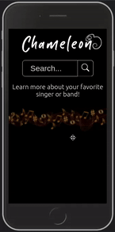

Caso a pessoa usuária digite o nome da banda incorretamente ou o nome de uma banda que não está no banco de dados uma mensagem será renderizada na tela.

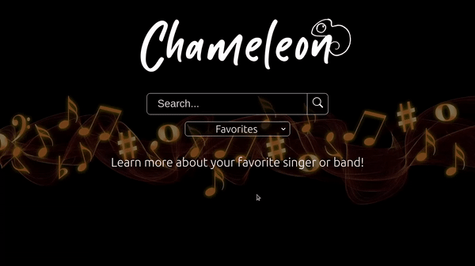  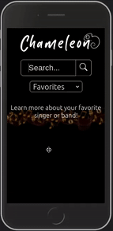

## Details
### Detalhes da banda ou artista

A página details apresenta alguns detalhes iniciais da banda:
- Ano de formação;
- Estilo;
- Gênero musical;
- Pais;
- Quantidade de membros.
Já oferecendo a opção de adicionar a banda em favoritos.

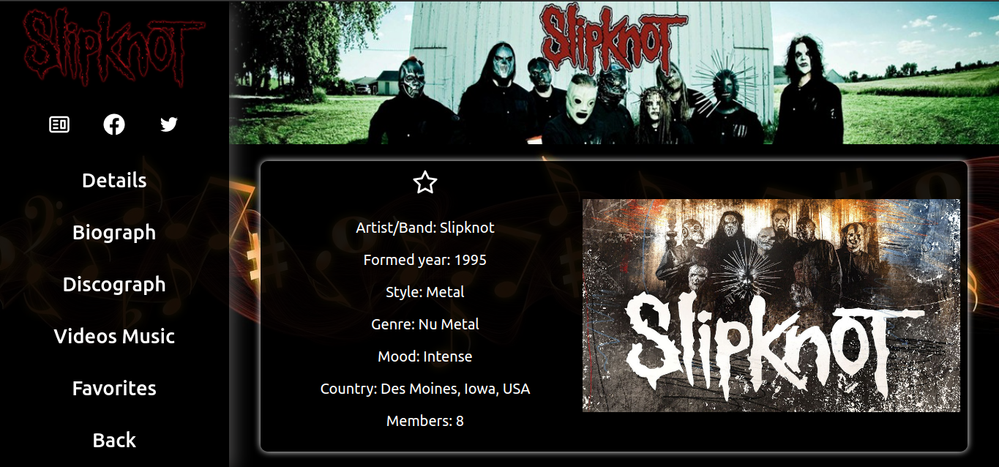  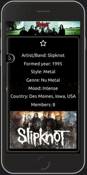

## Biography 
### Biografia da banda ou artista

Essa página exibe a biografia da banda ou artista, podendo estar disponível em vários idiomas, para selecionar um dos idiomas um seletor é renderizado com as opções. Como imagem de fundo da biografia, fotos da banda são renderizadas dinamicamente em intervalos de 3 segundos.

  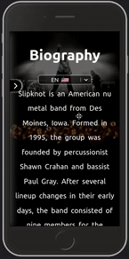

## Discography 
### Discografia da banda ou artista

Exibe os álbuns da banda ou artista ordenado pelo ano de lançamento, podendo ser filtrados pelo titulo, ao clicar em um dos álbuns, a pessoa usuária será redirecionada para a página de detalhes desse album.

  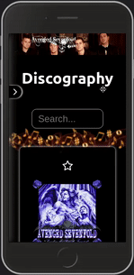

## Album Details 
### Destalhes do album selecionado

Após a pessoa usuária escolher um album, será redirecionada para a página com detalhes desse album, contendo a historia do album, podendo estar disponível em vários idiomas, contendo um seletor para a escolha. Também é exibido as tracks desse album, podendo ser filtradas pelo nome, ao clicar em uma track, a pessoa usuária será redirecionada para a página dessa track.

  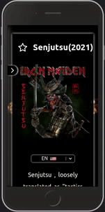

## Track
### Letra da musica escolhido junto ao vídeo quando disponível

Ao clicar em um track a pessoa usuária é redirecionada para uma página com a letra e o vídeo quando disponível, o vídeo por padrão acompanhara o scroll, porém a pessoa usuária tem a opção de deixá-lo na parte superior da página ou até mesmo fecha-lo através de butões na parte inferior do vídeo.

  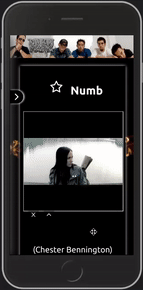

## Videos Music  

Exibe uma lista de todas as tracks que possuem vídeos, podendo ser filtradas, ao clicar em uma track, a pessoa usuária será direcionada para a página Track

  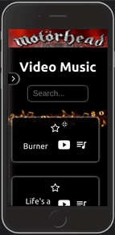

## Favorites

Exibe as tracks e álbuns salvos em favoritos, sendo que ao ser clicado é redirecionado para a página album details ou a página track, podendo também ser filtrado a partir de seus títulos.

  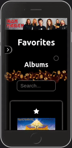

---

# Tecnologias

- React
- React Router
- Redux
- Redux Thunk
- React Select
- Testing Library
- MQ Polyfill
- UUID
- ESLint

   
  &nbsp;&nbsp;&nbsp;
  
  &nbsp;&nbsp;&nbsp;
  
  &nbsp;&nbsp;&nbsp;
  
  &nbsp;&nbsp;&nbsp;
  

---

# Testes

Usando o biblioteca testing library, foi desenvolvido 100% de cobertura de testes unitários para a aplicação.
Para rodar os testes localmente basta usar o comando `npm test` e `npm run coverage` para a verificação da cobertura;

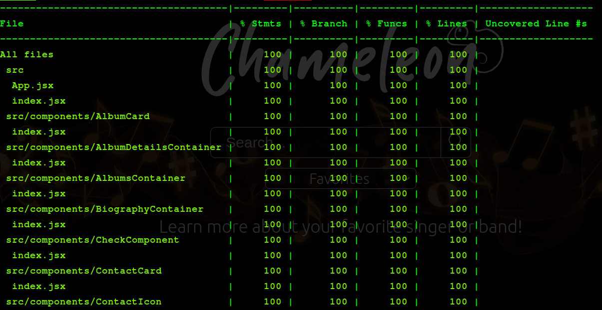
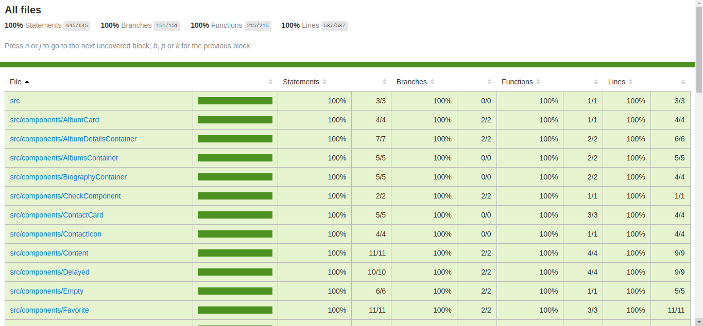

---

# Instruções para rodar os testes localmente

Depois de clonar o [repositório e instalar as dependencias](#instruções-para-rodar-localmente), basta rodar o comando `npm test` 

---

# APIs 

Para o desenvolvimento desse aplicativo foi utilizado a combinação de duas excelentes APIs: [The Audio DB](#https://www.theaudiodb.com/) e [Lyrics OVH](#https://lyricsovh.docs.apiary.io/)

---

# Deploy

Para o deploy da aplicação foi escolhido a [Vercel](#https://vercel.com/), pois além de permitir o deploy gratuito de projetos pessoais, preserva o comportamento original da rotas dos projetos React usando React Router Dom.

<h1><a href="https://chameleonmusic.vercel.app/" >Visit Chameleon</a></h1>
